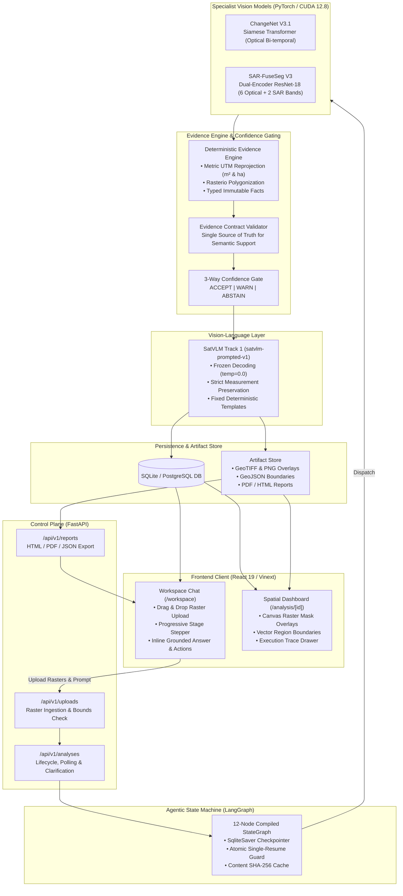
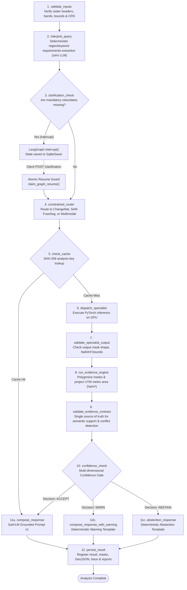

# SatQuery AI

[](https://www.python.org/)
[](https://pytorch.org/)
[](https://developer.nvidia.com/cuda-toolkit)
[](https://langchain-ai.github.io/langgraph/)
[](https://fastapi.tiangolo.com/)
[](https://vitejs.dev/)
[](https://tailwindcss.com/)
[](tests/)

**SatQuery AI** is an evidence-grounded, agentic satellite imagery analysis platform. It translates natural language geospatial queries into verifiable spatial evidence by orchestrating specialized computer vision models across optical and synthetic aperture radar (SAR) satellite imagery, computing mathematically projected ground metrics, and synthesizing grounded natural-language answers through a zero-hallucination prompted vision-language layer.

---

## Tech Stack (As Built & Operational)

The system is built exclusively on the following operational production stack:

| Layer | Technology | Version | Operational Role in Pipeline |
| :--- | :--- | :--- | :--- |
| **Agentic Orchestration** | LangGraph | 0.2.70+ | Compiled 12-node `StateGraph`, human-in-the-loop interrupt/resume, state checkpointing |
| **Deep Learning Runtime** | PyTorch | 2.11.0+cu128 | GPU tensor computation, batched inference, frozen weights execution |
| **Hardware Acceleration** | NVIDIA CUDA | 12.8 | Hardware tensor acceleration on NVIDIA GPUs |
| **Vision Backbones** | Torchvision / Timm | 0.20+ / 1.0+ | ResNet-18 dual encoders, feature pyramid heads, convolutional segmentation |
| **Geospatial Processing** | Rasterio / GDAL | 1.4.3 | Multi-band GeoTIFF ingestion, affine matrix transforms, pixel-to-polygon vectorization |
| **Metric Projections** | Pyproj | 3.7.1 | Dynamic UTM zone calculation & geodesic reprojection from WGS-84 to metric planar CRS |
| **Topological Geometries** | Shapely | 2.0.7 | Multi-polygon simplification, valid topology enforcement, exact ground area ($m^2$, $ha$) |
| **Backend API Control Plane** | FastAPI | 0.115.11 | High-throughput asynchronous REST API, file upload streaming, validation schemas |
| **ASGI Web Server** | Uvicorn | 0.34.0 | Asynchronous HTTP / WebSocket server with hot reload |
| **Relational Database / ORM**| SQLAlchemy | 2.0.38 | Metadata persistence, mission history tracking, LangGraph checkpointer storage |
| **Database Engines** | SQLite / PostgreSQL | 3.45+ / Psycopg 3 | Local development database (`var/satquery.db`) and production Postgres connectivity |
| **Report Engine** | ReportLab | 5.0.1 | Native binary PDF report compilation conforming to the evidence schema contract |
| **Web Frontend** | React / Vinext (Next.js) | 19.2.6 / Vite 8 | Reactive single-page client, chat workspace, canvas-based spatial overlay visualizer |
| **Styling & UI Components** | Tailwind CSS / Base UI | 4.2.1 / 1.7.0 | Modern utility design tokens, dark/light theme, accessible interactive modals |
| **Icons & Visuals** | Lucide React | 1.31.0 | Visual symbology for stages, layers, download formats, and confidence indicators |
| **Automated Verification** | Pytest | 9.1.1 | 56 automated unit, regression, and cross-model integration tests |

---

## High-Level System Architecture

The high-level architecture separates client interaction, API control plane, stateful graph orchestration, deep learning specialist inference, mathematical evidence extraction, confidence verification, and immutable report generation.

### System Architecture Diagram (ASCII)

```text
+---------------------------------------------------------------------------------------------------------+
|                                        FRONTEND CLIENT LAYER                                            |
|                                       (React 19 / Vite / Vinext)                                        |
|                                                                                                         |
|  +---------------------------------------+             +---------------------------------------------+  |
|  |       Workspace Chat (/workspace)     |             |       Spatial Dashboard (/analysis/[id])    |  |
|  |  * Drag-and-drop raster upload        |             |  * Interactive GeoTIFF canvas overlay       |  |
|  |  * Natural language query interface   |             |  * Vector boundary polygon visualization    |  |
|  |  * Real-time stage stepper progress   |             |  * Metric summary cards (ha, m2, conf)      |  |
|  |  * Inline grounded answer & actions   |             |  * Node-by-node audit execution trace       |  |
|  |  * PDF / HTML / JSON direct download  |             |  * Spatial layer opacity / mask toggles     |  |
|  +---------------------------------------+             +---------------------------------------------+  |
+------------------------------------|------------------------------------------^-------------------------+
                                     | POST /analyses (files + prompt)          | GET /analyses/{id}
                                     v                                          |
+---------------------------------------------------------------------------------------------------------+
|                                       FASTAPI CONTROL PLANE                                             |
|                                  (Uvicorn / Async REST Endpoints)                                       |
|                                                                                                         |
|  * /api/v1/uploads   : Multipart GeoTIFF ingestion, CRS & dimension validation                          |
|  * /api/v1/analyses  : Lifecycle orchestration, background worker trigger, status polling               |
|  * /api/v1/reports   : Multi-format immutable audit exports (HTML, PDF via ReportLab, JSON)             |
|  * /clarification    : Atomic human-in-the-loop resume endpoint                                         |
+------------------------------------|--------------------------------------------------------------------+
                                     | Initiates SatQueryState
                                     v
+---------------------------------------------------------------------------------------------------------+
|                                    LANGGRAPH STATE MACHINE CORE                                         |
|                                     (12-Node Compiled StateGraph)                                       |
|                                                                                                         |
|  +---------------------+   +---------------------+   +---------------------+   +---------------------+  |
|  | 1. validate_inputs  |-->| 2. interpret_query  |-->|3.clarification_check|-->|4.constrained_router |  |
|  +---------------------+   +---------------------+   +----------+----------+   +----------+----------+  |
|                                                                 |                         |             |
|                                                       [Needs Clarification?]              v             |
|                                                       YES: interrupt(HITL)     +---------------------+  |
|                                                                                |   5. check_cache    |  |
|                                                                                +----------+----------+  |
+-------------------------------------------------------------------------------------------|-------------+
                                                                                            |
                                      +-----------------------------------------------------+
                                      | Cache Miss
                                      v
+---------------------------------------------------------------------------------------------------------+
|                                   SPECIALIST VISION INFERENCE LAYER                                     |
|                                       (PyTorch 2.11 / CUDA 12.8)                                        |
|                                                                                                         |
|  +----------------------------------------------------+  +-------------------------------------------+  |
|  |             ChangeNet V3.1 Specialist              |  |         SAR-FuseSeg V3 Specialist         |  |
|  |  * Siamese Transformer backbone                    |  |  * Dual-stream ResNet-18 encoders         |  |
|  |  * Multi-scale bi-temporal optical attention (T1,T2)|  |  * 6 Optical bands (B02,03,04,08,11,12)  |  |
|  |  * Output: Binary change mask & probability logits |  |  * 2 SAR bands (VH, VV polarizations)    |  |
|  |  * Weights: models/checkpoints/changeformer_v3_1   |  |  * Output: 19 BigEarthNet class logits    |  |
|  +----------------------------------------------------+  +-------------------------------------------+  |
+---------------------------------------------------|-----------------------------------------------------+
                                                    | Probability Masks [0.0, 1.0]
                                                    v
+---------------------------------------------------------------------------------------------------------+
|                                 GROUNDING & EVIDENCE EXTRACTION LAYER                                   |
|                                                                                                         |
|  +---------------------------------------------------------------------------------------------------+  |
|  | 8. Deterministic Evidence Engine (Rasterio + Pyproj + Shapely)                                     |  |
|  |    * Contour extraction & polygonization via rasterio.features.shapes                             |  |
|  |    * Dynamic UTM zone detection & metric reprojection (pyproj)                                    |  |
|  |    * Exact polygon area computation in m2 and hectares (shapely)                                  |  |
|  |    * Lossless serialization into typed LandCoverFacts / ChangeFacts                               |  |
|  +--------------------------------------------------+------------------------------------------------+  |
|                                                     | Typed Spatial Facts                                |
|                                                     v                                                    |
|  +---------------------------------------------------------------------------------------------------+  |
|  | 9. Evidence Contract Validator (src/evidence_engine/validator.py)                                 |  |
|  |    * Evaluates semantic transition support (SUPPORTED / UNSUPPORTED / NOT_APPLICABLE)             |  |
|  |    * Detects spatial-temporal contradictions & logs non-destructive conflict records              |  |
|  +--------------------------------------------------+------------------------------------------------+  |
|                                                     | Validation Report                                  |
|                                                     v                                                    |
|  +---------------------------------------------------------------------------------------------------+  |
|  | 10. Multi-Dimensional 3-Way Confidence Gate (backend/app/orchestration/confidence_gate.py)        |  |
|  |     Formal Priority Hierarchy:                                                                    |  |
|  |     [ABSTAIN] : Invalid contract > Unsupported transition > Missing mandatory fact                |  |
|  |     [WARN]    : Specialist conflict detected > Uncalibrated metadata dependency                   |  |
|  |     [ACCEPT]  : Contract valid, confidence >= 0.60, complete semantic grounding                   |  |
|  +--------------------------------------------------+------------------------------------------------+  |
+-----------------------------------------------------|---------------------------------------------------+
                                                      |
                   +----------------------------------+----------------------------------+
                   | Decision: ACCEPT                 | Decision: WARN                   | Decision: ABSTAIN
                   v                                  v                                  v
+---------------------------------------------------------------------------------------------------------+
|                                    SATVLM REASONING & COMPOSITION LAYER                                 |
|                                    (Track 1: satvlm-prompted-v1 Freeze)                                 |
|                                                                                                         |
|  +-----------------------------+   +-----------------------------+   +-------------------------------+  |
|  | 11a. Grounded Prompt v1     |   | 11b. Explicit Warning Model |   | 11c. Deterministic Abstention |  |
|  |  * temp=0.0, zero-sample    |   |  * Surfaces detected hazard |   |  * Fixed rejection template   |  |
|  |  * Strict metric injection  |   |  * Reports partial evidence |   |  * Halts speculative synthesis|  |
|  |  * Zero metric hallucination|   |  * Flags uncalibrated source|   |  * Audit reason logged        |  |
|  +-----------------------------+   +-----------------------------+   +-------------------------------+  |
+--------------------------------------------------|------------------------------------------------------+
                                                   |
                                                   v
+---------------------------------------------------------------------------------------------------------+
|                                      PERSISTENCE & ARTIFACT LAYER                                       |
|                                                                                                         |
|  +---------------------------------------------+   +-------------------------------------------------+  |
|  | SQLite / PostgreSQL Database Engine          |   | Filesystem Artifact Store                       |  |
|  |  * Analysis state & requirements metadata   |   |  * Ingested GeoTIFF rasters (uploads/)          |  |
|  |  * Grounded answer & confidence metrics     |   |  * Output binary & multi-class masks (masks/)   |  |
|  |  * Serialized execution trace steps         |   |  * Vector contour GeoJSON (geojson/)            |  |
|  |  * LangGraph SqliteSaver checkpointer state |   |  * Generated HTML, PDF, and JSON audit reports  |  |
|  +---------------------------------------------+   +-------------------------------------------------+  |
+---------------------------------------------------------------------------------------------------------+
```

### System Architecture Flow (Mermaid)



---

## Low-Level Orchestration Architecture

The operational core is implemented as a 12-node compiled **LangGraph** `StateGraph`. Execution state is held in `SatQueryState`, backed by checkpointer persistence for human-in-the-loop clarification.

### 12-Node StateGraph Execution Flow (ASCII)

```text
                                  +-----------------------+
                                  |     USER REQUEST      |
                                  | (Rasters + Text Prompt)
                                  +-----------+-----------+
                                              |
                                              v
                                  +-----------------------+
                                  |  1. validate_inputs   |
                                  | Checks GeoTIFF headers|
                                  | bands, CRS & bounds   |
                                  +-----------+-----------+
                                              |
                                              v
                                  +-----------------------+
                                  |  2. interpret_query   |
                                  | Deterministic regex   |
                                  | requirement extractor |
                                  +-----------+-----------+
                                              |
                                              v
                                  +-----------------------+
                                  | 3.clarification_check |
                                  | Missing role or date? |
                                  +-----------+-----------+
                                              |
                             +----------------+----------------+
                             |                                 |
                     [Yes: Missing Role]                [No: Complete]
                             |                                 |
                             v                                 v
                 +-----------------------+         +-----------------------+
                 |   interrupt(HITL)     |         | 4. constrained_router |
                 | Saves state to SQLite |         | Determines specialist |
                 | Awaits POST /clarify  |         | (ChangeNet / FuseSeg) |
                 +-----------+-----------+         +-----------+-----------+
                             |                                 |
                             | Resume via                      |
                             | claim_graph_resume()            v
                             +-------------------->+-----------------------+
                                                   |    5. check_cache     |
                                                   | SHA-256 analysis key  |
                                                   +-----------+-----------+
                                                               |
                                            +------------------+------------------+
                                            |                                     |
                                      [Cache Hit]                            [Cache Miss]
                                            |                                     |
                                            |                                     v
                                            |                         +-----------------------+
                                            |                         | 6. dispatch_specialist|
                                            |                         | Runs ChangeNet V3.1 or|
                                            |                         | SAR-FuseSeg V3 on GPU |
                                            |                         +-----------+-----------+
                                            |                                     |
                                            |                                     v
                                            |                         +-----------------------+
                                            |                         | 7. validate_specialist|
                                            |                         | Validates mask shape, |
                                            |                         | finite bounds [0, 1]  |
                                            |                         +-----------+-----------+
                                            |                                     |
                                            |                                     v
                                            |                         +-----------------------+
                                            |                         | 8. run_evidence_engine|
                                            |                         | Polygonize contours & |
                                            |                         | project UTM m2 / ha   |
                                            |                         +-----------+-----------+
                                            |                                     |
                                            |                                     v
                                            |                         +-----------------------+
                                            |                         |9. validate_evidence_  |
                                            |                         |   contract            |
                                            |                         | Check semantic support|
                                            |                         | and conflict logging  |
                                            |                         +-----------+-----------+
                                            |                                     |
                                            |                                     v
                                            |                         +-----------------------+
                                            |                         | 10. confidence_check  |
                                            |                         | Multi-dim 3-Way Gate  |
                                            |                         +-----------+-----------+
                                            |                                     |
                                            |         +---------------------------+---------------------------+
                                            |         |                           |                           |
                                            |     [ACCEPT]                      [WARN]                    [ABSTAIN]
                                            |         |                           |                           |
                                            v         v                           v                           v
                                  +-----------------------+   +-----------------------+   +-----------------------+
                                  | 11a. compose_response |   | 11b. compose_response |   | 11c. abstention_      |
                                  | Grounded Prompt v1    |   |      _with_warning    |   |      response         |
                                  | temp=0.0, zero-sample |   | Surfaces hazard flag  |   | Rejection template    |
                                  | Exact metric facts    |   | Reports partial data  |   | Halts hallucinations  |
                                  +-----------+-----------+   +-----------+-----------+   +-----------+-----------+
                                              |                           |                           |
                                              +---------------------------+---------------------------+
                                                                          |
                                                                          v
                                                              +-----------------------+
                                                              |   12. persist_result  |
                                                              | Writes DB row, GeoJSON|
                                                              | masks, execution trace|
                                                              | Pre-renders reports   |
                                                              +-----------+-----------+
                                                                          |
                                                                          v
                                                              +-----------------------+
                                                              |    ANALYSIS COMPLETE  |
                                                              | Renders in Workspace  |
                                                              | & Spatial Dashboard   |
                                                              +-----------------------+
```

### 12-Node Flowchart (Mermaid)



### StateGraph Node Specifications

| Node | Implementation | Responsibility & Invariants |
| :--- | :--- | :--- |
| `1. validate_inputs` | `validate_inputs_node` | Validates raster dimensions, channel counts, CRS headers, and acquisition metadata. Rejects corrupted or out-of-spec imagery. |
| `2. interpret_query` | `interpret_query_node` | Zero-LLM deterministic extraction of `QueryRequirements`. Determines required evidence types, measurement requests, temporal change requirements, and uncalibrated dependencies. |
| `3. clarification_check` | `clarification_check_node` | Detects missing file roles (e.g. which image is pre- vs. post-event) or unaligned modalities. Triggers `interrupt()` and records structured clarification payload. |
| `4. constrained_router` | `constrained_router_node` | Deterministically maps input modalities + query intent to specialist pipelines (`bitemporal_change_detection` vs `land_cover_segmentation` vs `multimodal_fusion`). |
| `5. check_cache` | `check_cache_node` | Computes content SHA-256 cache key over input rasters, query string, and specialist version. Reuses verified results on identical inputs. |
| `6. dispatch_specialist` | `dispatch_specialist_node` | Invokes PyTorch models on GPU with frozen weights. Runs **ChangeNet V3.1** or **SAR-FuseSeg V3**. |
| `7. validate_specialist_output` | `validate_specialist_output_node` | Validates specialist output probability masks: dimension parity with input raster, absence of NaN/Inf, and probability bounds $[0.0, 1.0]$. |
| `8. run_evidence_engine` | `run_evidence_engine_node` | Runs polygonization (`rasterio.features.shapes`), simplifies contours (`shapely`), reprojects to local UTM CRS (`pyproj`), and serializes exact typed facts (`LandCoverFacts`, `ChangeFacts`). |
| `9. validate_evidence_contract` | `validate_evidence_contract_node` | Pre-composition validation (`validator.py`). Evaluates semantic transition support (`SUPPORTED`, `UNSUPPORTED`, `NOT_APPLICABLE`) and performs non-destructive conflict logging. |
| `10. confidence_check` | `confidence_check_node` | Multi-dimensional 3-way Confidence Gate (`confidence_gate.py`). Implements formal priority hierarchies: `ABSTAIN` (Invalid contract > Unsupported transition > Missing fact) and `WARN` (Specialist conflict > Uncalibrated dependency). |
| `11. compose_response` | `compose_response_node` / `compose_response_with_warning_node` / `abstention_response_node` | Track 1 production freeze (`satvlm-prompted-v1`). Pinned decoding (`temp=0.0`, `do_sample=false`). Enforces zero measurement hallucination; outputs fixed templates on WARN/ABSTAIN. |
| `12. persist_result` | `persist_result_node` | Commits analysis row, stores binary raster masks, writes GeoJSON vectors, registers execution trace, and pre-renders reports. |

---

## Specialist Model Architecture Details

### 1. SAR-FuseSeg V3 (`src/sar_fuse_seg/`, `backend/app/specialists/sar_fuse_seg.py`)
- **Architecture**: Dual-stream deep neural network with separate ResNet-18 feature extractors for Optical and SAR inputs, merged via feature concatenation and a multi-scale convolutional segmentation head.
- **Input Channels**: Strict 8-band input:
  - Optical stream: 6 multispectral bands (B02, B03, B04, B08, B11, B12).
  - SAR stream: 2 polarimetric bands (VH, VV).
- **Patch Resolution**: Native frozen inference on $120 \times 120$ pixel tiles; versioned sliding-window tiling (`tiled_inference_versioned`) with overlap stitching for arbitrary scenes.
- **Classes**: 19 BigEarthNet multi-class land-cover categories.
- **Weights**: Frozen checkpoint at `models/checkpoints/sar_fuse_v3/best.pt`. Zero channel fabrication.

### 2. ChangeNet V3.1 (`backend/app/specialists/changenet.py`, `src/changeformer/`)
- **Architecture**: Siamese Transformer feature extractor with multi-scale difference attention for bi-temporal optical change detection.
- **Inputs**: Pre-event ($T_1$) and Post-event ($T_2$) optical scenes.
- **Output**: Binary change mask ($0$ = unchanged, $1$ = changed) + change probability heatmap.
- **Weights**: Frozen checkpoint at `models/checkpoints/changeformer_v3_1_best.pt`.

### 3. SatVLM Track 1 Baseline (`backend/app/services/satvlm_prompt.py`)
- **Role**: Reasoning, explanation, and response-composition layer over verified specialist facts.
- **Production Freeze**: `satvlm-prompted-v1`. Zero weight modifications; zero fine-tuning required.
- **Decoding Configuration**: `temperature = 0.0`, `do_sample = False`, `top_p = 1.0`, `max_new_tokens = 512`.
- **Enforcement Rules**:
  - Enforces zero channel fabrication.
  - Zero measurement estimation (preserves specialist-supplied units, hectare area, and percentages exactly).
  - Emits fixed, deterministic templates on `WARN` and `ABSTAIN` decisions, preserving raw validator errors in the audit trace only.

---

## Actual Built Stack & Technologies

| Layer | Technology | Version | Purpose in SatQuery AI |
| :--- | :--- | :--- | :--- |
| **Orchestration** | LangGraph | 0.2.70+ | Stateful StateGraph execution, HITL interrupt/resume, checkpointer |
| **Deep Learning** | PyTorch | 2.11.0+cu128 | Specialist model execution on NVIDIA RTX GPUs |
| **Acceleration** | NVIDIA CUDA | 12.8 | Hardware GPU tensor computation |
| **Computer Vision** | Torchvision / Timm | 0.20+ / 1.0+ | Backbone neural architectures (ResNet-18 dual encoders) |
| **Geospatial Processing** | Rasterio | 1.4.3 | GeoTIFF I/O, band extraction, affine transforms, polygonization |
| **Geospatial Projections** | Pyproj | 3.7.1 | Dynamic CRS reprojection into local UTM zones for ground metrics |
| **Geometric Operations** | Shapely | 2.0.7 | Polygon simplification, topological validation, multipolygon union |
| **Backend Framework** | FastAPI | 0.115.11 | High-throughput async REST API control plane |
| **ASGI Server** | Uvicorn | 0.34.0 | Production HTTP/WebSocket application server |
| **Database & ORM** | SQLAlchemy | 2.0.38 | Relational metadata store, execution bookkeeping, query caching |
| **Database Engines** | SQLite / PostgreSQL | 3.45+ / Psycopg 3 | Local development database (`var/satquery.db`) & pooled Postgres |
| **Report Generation** | ReportLab | 5.0.1 | Binary PDF generation conforming to the evidence schema contract |
| **Frontend Framework** | React / Next.js (Vinext) | 19.2.6 / Vite 8 | Reactive web application, routing, and SSR |
| **Styling** | Tailwind CSS | 4.2.1 | Modern design system, responsive layouts |
| **UI Primitives** | Base UI / Lucide | 1.7.0 / 1.31.0 | Accessible UI controls, modal dialogues, icons |
| **Testing** | Pytest | 9.1.1 | 56 automated unit, regression, and integration tests |

---

## Repository Structure (Core Main Pipeline)

```
SatQuery/
├── backend/                                # FastAPI Control Plane & Orchestration
│   ├── app/
│   │   ├── api/v1/                         # REST API endpoints (uploads, analyses, reports)
│   │   ├── core/                           # Configuration, errors, logging, artifact storage
│   │   ├── db/                             # SQLAlchemy models, repositories, database session
│   │   ├── orchestration/                  # LangGraph StateGraph, nodes, state, confidence gate
│   │   │   ├── graph.py                    # Compiled 12-node StateGraph
│   │   │   ├── nodes.py                    # Discrete node logic & response handlers
│   │   │   ├── state.py                    # SatQueryState typed dictionary schema
│   │   │   ├── cache.py                    # SHA-256 analysis key computation
│   │   │   └── confidence_gate.py          # Deterministic 3-way Confidence Gate
│   │   ├── services/                       # SatVLM prompt engine, report service, result service
│   │   │   ├── satvlm_prompt.py            # satvlm-prompted-v1 freeze & templates
│   │   │   └── report_service.py           # HTML, PDF (ReportLab), and JSON renderers
│   │   ├── specialists/                    # ChangeNet V3.1 & SAR-FuseSeg V3 execution adapters
│   │   └── workers/                        # Background queue runners (inline & RQ)
│   └── requirements.txt                    # Python dependencies
│
├── frontend/                               # React 19 / Vinext Client Application
│   ├── features/
│   │   ├── workspace/                      # Chat interface, file upload dropzone, inline responses
│   │   ├── results/                        # Full result page, map canvas, metrics, report downloads
│   │   ├── history/                        # Mission history listing
│   │   └── landing/                        # Landing page
│   ├── components/
│   │   ├── visuals/scene-map.tsx           # Canvas raster overlay and vector boundary map
│   │   └── ui/                             # Buttons, inputs, modals, cards
│   └── package.json
│
├── src/                                    # Grounding & Domain Packages
│   ├── evidence_engine/                    # Deterministic Evidence Engine
│   │   ├── contracts.py                    # Typed contracts: QueryRequirements, ValidationReport
│   │   ├── validator.py                    # Pre-composition contract validator
│   │   ├── serializer.py                   # Lossless fact serializer
│   │   ├── polygonizer.py                  # Raster-to-polygon vector extraction
│   │   └── metrics.py                      # UTM projected metric calculations (m² & ha)
│   ├── sar_fuse_seg/                       # Dual-encoder SAR + Optical fusion architecture
│   └── changeformer/                       # ChangeFormer transformer model definitions
│
├── models/                                 # Frozen Model Checkpoints
│   └── checkpoints/
│       ├── sar_fuse_v3/best.pt             # SAR-FuseSeg V3 weights
│       └── changeformer_v3_1_best.pt       # ChangeNet V3.1 weights
│
├── tests/                                  # Full Automated Regression Test Suite (56 tests)
│   ├── test_satvlm_track1.py               # SatVLM prompted reasoning & confidence gate tests (22)
│   ├── test_evidence_engine.py             # Spatial projection & polygonizer tests (13)
│   ├── test_sar_fuse_seg.py                # Dual-encoder architecture & tiling tests (10)
│   ├── test_langgraph_pipeline.py          # StateGraph assembly, routing & HITL tests (6)
│   ├── test_cross_model_integration.py     # Cross-model grid alignment & temporal tests (3)
│   └── test_report_generation.py           # HTML, PDF (ReportLab), and JSON report tests (2)
│
├── artifacts/                              # Local artifact storage (uploads, masks, reports)
└── .gitignore                              # Strict exclusion of weights, datasets, & plan drafts
```

---

## Getting Started

### 1. Activate Environment & Verify Dependencies

```powershell
# Activate Python virtual environment
.\.venv\Scripts\Activate.ps1

# Verify PyTorch CUDA 12.8 GPU support
python -c "import torch; print(f'CUDA: {torch.cuda.is_available()} | GPU: {torch.cuda.get_device_name(0)}')"
```

### 2. Run the Automated Test Suite (56 Tests Green)

```powershell
pytest tests/ -v
```

Expected output:
```
====================== 56 passed, 89 warnings in 43.59s =======================
```

### 3. Start the Backend API Server

```powershell
# Set PYTHONPATH and launch FastAPI on port 8000
$env:PYTHONPATH = "e:\SatQuery\backend;e:\SatQuery\src;e:\SatQuery"
python -m uvicorn app.main:app --port 8000 --host 127.0.0.1 --reload
```
- **API Documentation (Swagger)**: `http://127.0.0.1:8000/docs`
- **Health Check Endpoint**: `http://127.0.0.1:8000/api/v1/health`

### 4. Start the Frontend Client

```powershell
cd frontend
npm run dev
```
- **Interactive Workspace**: `http://localhost:3000/workspace`
- **Analysis Result Viewer**: `http://localhost:3000/analysis/[analysisId]`

---

## Verifiable Output Contracts

When an analysis completes, SatQuery AI provides three synchronized representations:
1. **Interactive UI Chat Bubble**: Renders the grounded answer text, measured area in hectares, confidence badge, and direct download links.
2. **Spatial Visualizer (`/analysis/[id]`)**: Interactive scene map with toggleable raster probability overlays, vector polygons, specialist confidence breakdowns, and the full step-by-step execution trace.
3. **Immutable Reports (`/api/v1/analyses/{id}/report`)**:
   - `?format=html`: Standalone styled audit report.
   - `?format=pdf`: Compiled binary PDF generated with ReportLab.
   - `?format=json`: Machine-readable schema conforming to the evidence contract.
