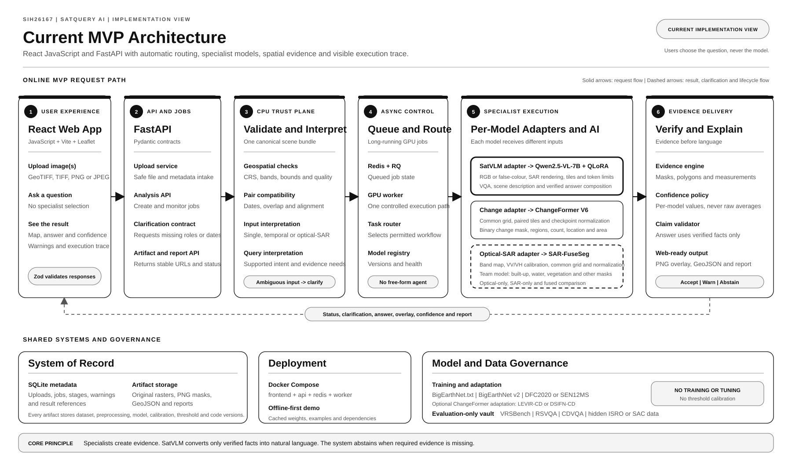

# SatQuery AI Current MVP Architecture

## Document Status

- Problem Statement: SIH26167
- Architecture version: Current Engineering View 1.2
- Related implementation plan: Freeze Candidate 1.1
- Diagram style: Strict monochrome with black, white, and neutral grey only
- Frontend: React with JavaScript and Vite
- Backend: FastAPI with Python
- Map interface: React Leaflet
- Execution model: FastAPI jobs with Redis, RQ, and a controlled GPU worker
- Specialist models: SatVLM, ChangeNet, and SAR-FuseSeg

## Clean Architecture Diagram



Standalone SVG:

[Open the clean architecture SVG](./SatQuery_AI_Current_MVP_Architecture.svg)

## 1. Architecture Summary

SatQuery AI is a web application that converts satellite image files and a natural-language question into an evidence-backed spatial answer.

The user does not select a model. The system:

1. Receives image files and the question through the React interface.
2. Validates the files and creates one canonical geospatial scene bundle.
3. Determines whether the request is single-image, temporal, or optical-SAR.
4. Requests clarification if dates, modality, or file roles cannot be determined safely.
5. Creates an asynchronous analysis job.
6. Routes the job to an approved specialist workflow.
7. Applies model-specific preprocessing.
8. Runs SatVLM, ChangeNet, or SAR-FuseSeg.
9. Converts model output into masks, regions, measurements, and structured facts.
10. Returns an answer with evidence, confidence, warnings, model versions, and an execution trace.

## 2. Main Components

### 2.1 React web application

Technology:

- React with JavaScript
- Vite
- React Leaflet
- TanStack Query
- Zustand or React Context
- Zod runtime validation

Responsibilities:

- Upload one or more images
- Collect the natural-language question
- Collect optional dates or sensor hints
- Display validation results
- Display clarification requests
- Poll job status
- Render raster overlays and GeoJSON
- Display the final answer and separate specialist confidence values
- Display warnings and execution trace
- Download the report

React never asks the user to choose SatVLM, ChangeNet, or SAR-FuseSeg.

### 2.2 FastAPI application

Responsibilities:

- Validate API requests using Pydantic
- Securely receive and store image files
- Create upload and analysis identifiers
- Expose validation, analysis, status, artifact, and report endpoints
- Return clarification responses for ambiguous inputs
- Queue long-running model jobs
- Return stable result and artifact URLs

FastAPI remains responsive while the GPU worker performs inference.

### 2.3 Canonical scene builder

The canonical scene bundle is the shared source of truth. It preserves:

- Original file references
- File hashes
- CRS
- Geographic bounds
- Raster width and height
- Pixel resolution
- Band names and order
- Nodata values
- Acquisition dates
- Sensor and modality metadata
- Pair relationships
- Alignment transforms
- Tile index
- Data-quality flags
- Provenance

The canonical scene builder does not apply one shared model normalization.

### 2.4 Geospatial validation

Validation checks:

- File signature, MIME type, extension, and safe size
- Raster readability
- CRS and geographic bounds
- Band availability
- Pixel resolution
- Nodata and invalid values
- Geographic overlap
- Temporal order
- Optical-SAR compatibility
- Residual pair alignment

The MVP reprojects and resamples inputs to a common grid. It should reject badly misaligned pairs instead of promising unrestricted automatic co-registration.

### 2.5 Input and query interpretation

The interpretation service combines:

- Number of uploaded files
- Sensor metadata
- Modality metadata
- Acquisition dates
- Pair compatibility
- Natural-language intent

It produces one of these outcomes:

- `single_image`
- `bi_temporal`
- `optical_sar`
- `needs_clarification`
- `unsupported`

The clarification flow asks only for missing information such as which file is earlier or which file is SAR. It never asks the user to select a model.

### 2.6 Asynchronous control plane

Components:

- Redis
- RQ
- One controlled GPU worker for the MVP
- Constrained task router
- Versioned model registry

The API creates the job and returns immediately. The worker:

1. Loads the approved job plan.
2. Applies the correct model adapter.
3. Executes only the required specialist.
4. Writes artifacts and structured evidence.
5. Updates the job state.

Recommended MVP job states:

```text
created
-> validating
-> needs_clarification
-> queued
-> preprocessing
-> inferencing
-> interpreting_evidence
-> composing_answer
-> completed

Failure states:
rejected | failed | abstained | cancelled
```

## 3. Specialist Workflows

### 3.1 SatVLM workflow

Model:

- Qwen2.5-VL-7B-Instruct
- Remote-sensing adaptation using 4-bit QLoRA

Preprocessing:

- RGB or documented false-colour rendering for optical imagery
- Calibrated VV and VH visualization for supported SAR questions
- Large-scene tiling
- Qwen processor resizing
- Maximum visual token limits
- Tile-to-scene coordinate tracking

Responsibilities:

- Single-image VQA
- Scene description
- Verified answer composition from structured specialist evidence

Restrictions:

- SatVLM is not the source of geographic coordinates.
- SatVLM is not the source of mask area.
- SatVLM may not add facts absent from the evidence object.

### 3.2 ChangeNet workflow

Model:

- ChangeFormer V6 pretrained baseline
- Optional fine-tuning only when baseline evaluation justifies it

Preprocessing:

- T1 and T2 on a common CRS, grid, resolution, and extent
- Identical paired crops
- Fixed-size paired tiles
- Checkpoint-specific normalization
- Inverse coordinate transform for mask restoration

Responsibilities:

- Binary change mask
- Changed regions
- Changed area and percentage
- Region count
- Relative or geographic location

MVP limitation:

ChangeNet alone cannot claim a semantic transition such as vegetation becoming built-up. Semantic change requires another classification step. The MVP change answer should remain limited to detected change, location, count, and area unless that additional evidence exists.

### 3.3 SAR-FuseSeg workflow

Model:

- Team-developed dual-encoder semantic segmentation model

Preprocessing:

- Versioned optical band mapping
- SAR VV and VH calibration
- Log or decibel scaling
- Common optical-SAR grid and resolution
- Separate optical and SAR normalization
- Valid-data mask

Initial output classes:

- Built-up
- Water
- Vegetation
- Other

Required evaluation:

- Optical-only baseline
- SAR-only baseline
- Optical-SAR fused baseline
- Geographic data split
- Same-scene tile-leakage prevention
- Class-mapping and label-provenance audit

## 4. Evidence Engine

The evidence engine converts model output into a stable structure that the UI and SatVLM can consume.

### Change evidence

- Clean mask
- Connected regions
- Polygon boundaries
- Changed area
- Changed percentage
- Region count
- Location

### Optical-SAR evidence

- Class masks
- Class polygons
- Area per class
- Per-class confidence
- Optical-only, SAR-only, and fused comparison

### Web delivery formats

For the MVP:

- Return a PNG mask overlay with geographic bounds.
- Return GeoJSON polygons for detected regions.
- Return the original measurement CRS and the projected CRS used for area calculation.
- Return pixel percentage and relative location for non-georeferenced PNG or JPEG inputs.
- Never return invented geographic area or coordinates for non-georeferenced imagery.

## 5. Confidence and Answer Policy

SatVLM, ChangeNet, and SAR-FuseSeg must be calibrated independently.

The system must:

- Show separate specialist confidence values.
- Never average raw model scores.
- Use task-specific accept, warning, and abstention thresholds.
- Store calibration versions with every result.
- Mark unsupported claims as invalid.
- Abstain when required evidence is missing or below threshold.

For free-text SatVLM output, the system should prefer evidence coverage and unsupported-claim counts over an unexplained generic AI-confidence percentage.

## 6. Storage

### SQLite metadata

- Upload records
- Analysis jobs
- Job stages
- Detected input type
- Selected workflow
- Model versions
- Warning and failure states
- Artifact references

### Local artifact storage for MVP

- Original uploaded rasters
- Canonical scene manifests
- Prepared model tiles
- PNG mask overlays
- GeoJSON regions
- Reports
- Frozen checkpoints

Each result records:

- Dataset version
- Preprocessing version
- Model version
- Calibration version
- Threshold version
- Code revision

## 7. Data Governance

### Training and adaptation data

- BigEarthNet.txt for SatVLM QLoRA
- BigEarthNet v2 for paired optical-SAR data
- DFC2020 or SEN12MS for SAR-FuseSeg spatial supervision
- LEVIR-CD or DSIFN-CD only for optional ChangeFormer adaptation

### Evaluation-only vault

- VRSBench
- RSVQA
- CDVQA
- Hidden ISRO or SAC data

Evaluation-only data cannot be used for:

- Training
- QLoRA adaptation
- Prompt selection
- Hyperparameter tuning
- Checkpoint selection
- Calibration fitting
- Threshold selection
- Manual selection of favourable examples

## 8. Deployment

Docker Compose services:

```text
frontend      React JavaScript application
api           FastAPI application
redis         Job queue and status transport
worker        Controlled CPU and GPU inference worker
```

SQLite and artifact directories are mounted as persistent volumes.

For the MVP, use one GPU worker and serialize GPU-intensive jobs. Add multiple workers only after measuring VRAM usage and model-loading behaviour.

## 9. Core API Flow

```text
POST /api/v1/uploads
    -> upload_id

POST /api/v1/validation
    -> valid | needs_clarification | rejected

POST /api/v1/analyses
    -> analysis_id + queued status

GET /api/v1/analyses/{analysis_id}/status
    -> job stage and progress

GET /api/v1/analyses/{analysis_id}/result
    -> answer, evidence, confidence, warnings and trace

GET /api/v1/analyses/{analysis_id}/report
    -> downloadable report
```

## 10. Architecture Principles

1. Users choose the question, not the model.
2. Validate geospatial inputs before inference.
3. Preserve one canonical scene and provenance record.
4. Use separate preprocessing for every specialist.
5. Route only to permitted workflows.
6. Produce evidence before language.
7. Calibrate each model independently.
8. Never average unrelated raw confidence scores.
9. Abstain instead of inventing unsupported answers.
10. Keep evaluation benchmarks physically isolated.
11. Version every model, transform, threshold, and artifact.
12. Keep the MVP narrow, reproducible, and offline-capable.

## 11. Related Document

[SatQuery AI MVP Implementation Plan](./SIH26167_SatQuery_AI_MVP_Implementation_Plan.md)
